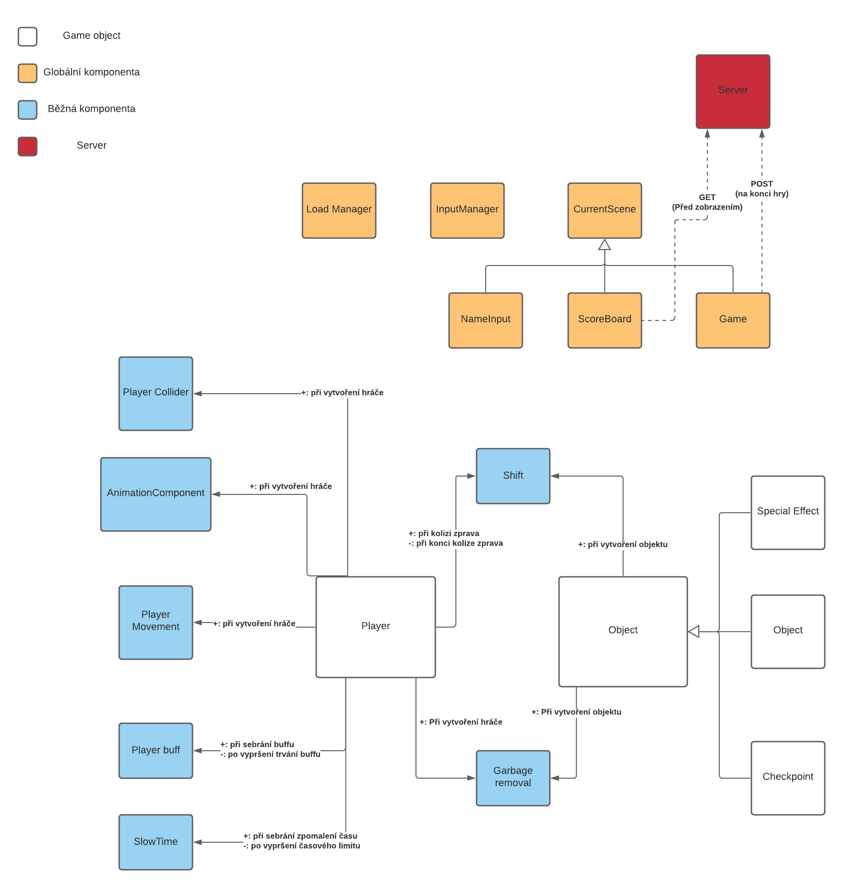

# NI-APH - Tomáš Vahalík & Jakub Rathouský

## Spuštění hry
Před prvním spuštěním hry je potřeba provést
```
npm install
```
Poté se hra spustí příkazem
```
npm run dev
```
Ten spustí jednak jednoduchý backend server a následně i samotnou hru.

### Hra se ovládá pomocí klávesy SPACE, kterou hráč mění gravitaci.


# Architektura hry
Jak již bylo zmíněno, ke hře jsme vytvořili jednoduchý Nodejs server, který přijímá HTTP požadavky pro uložení nového skóre (POST),
nebo pro vrácení seznamu všech dosažených bodů společně s přezdívkami hráčů, kteří jich dosáhli (GET). Server si dosažené skóre ukládá pouze
in-memory, tedy při každém restartu se záznamy ztratí.

Samotná hra využívá ECS architekturu.



# Nasazení hry

Hra je nasazena na Heroku (<a href="https://gravity-guy.herokuapp.com/">Zde</a>) a buduje si solidní hráčskou základnu.


## Globální komponenty
Ve hře využíváme 4 globální komponenty:

**ECS Input Component** - pouze zaznamenává stisknutí kláves


**Input Manager** - zkoumá, která tlačítka jsou stisknutá a reaguje na to posíláním příslušných zpráv

**Komponenta se současnou scénou** - ve hře jsou 3 scény: vybrání přezdívky, zobrazení výsledků a samotná hra

**Load Manager** - má na starosti přepínání mezi scénami (starou odstraní, novou přidá)


## Herní objekty
Ve hře máme 4 druhy objektů :

**Hráč** - snaží se proběhnout celou trať

**Překážka** - objekty, po kterých se hráč pohybuje a může s nimi kolidovat

**Checkpoint** - po smrti (vypadnutí z trati) se hráč respawnuje u posledního proběhnutého checkpointu 

**Speciální efekt** - může být buď zrychlení hráče, nebo zpomalení času

Pro vytváření objektů jsme využili factory pattern.

## Komponenty u objektů


**Shift** - komponenta, která posouvá objekty zprava doleva. Mají ji všechny překážky, speciální efekty a checkpointy, 
hráč ji získá, pokud koliduje s překážkou zprava.

**Garbage removal** -  má na starost odstranit objekty, které vypadly ze scény.
Pokud vypadl hráč, pošle zprávu o tom, že by se měl načíst poslední checkpoint. Když vypadne něco jiného, tak daný objekt zničí,
aby se s ním zbytečně nepočítalo např. při zjišťování kolizí.

## Komponenty u hráče

**Player collider** - Komponenta řešící kolize. Každý update si najde seznam všech herních objektů s tagem "COLLIDABLE"
a pro každý z nich rozhodne, zda s ním hráč koliduje nebo ne. Posílá zprávy při vstoupení a vystoupení z kolize.

**Player movement** - hlavní ovladač hráče. Má na starosti pohyb hráče - nahoru a dolů, reaguje na změny gravitace. 
Vždy když nastane kolize (detekovaná colliderem), tak rozhodne co se má stát podle toho, s jakým objektem hráč koliduje.

**Player buff** a **Slow motion** - přidávají se ke hráči při kolizi se speciálním efektem. Jedna zrychlí hráče (pohyb doprava), 
druhá zpomalí čas.

**Animation component** - řeší animaci hráče (když je zpomalený čas, i animace se přehrává pomaleji).


